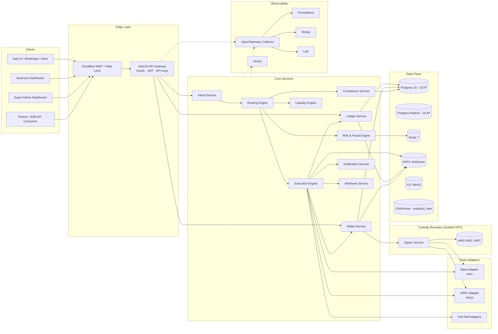
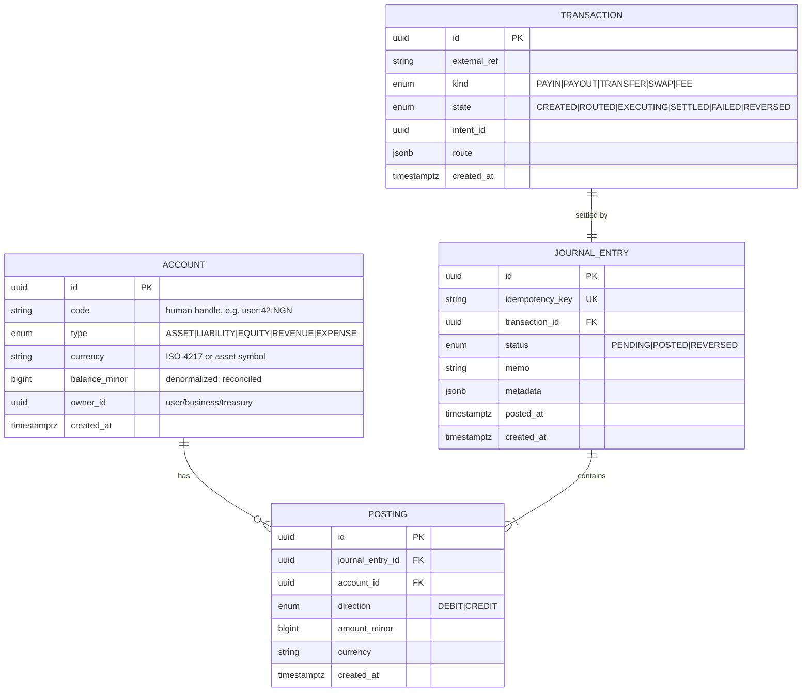
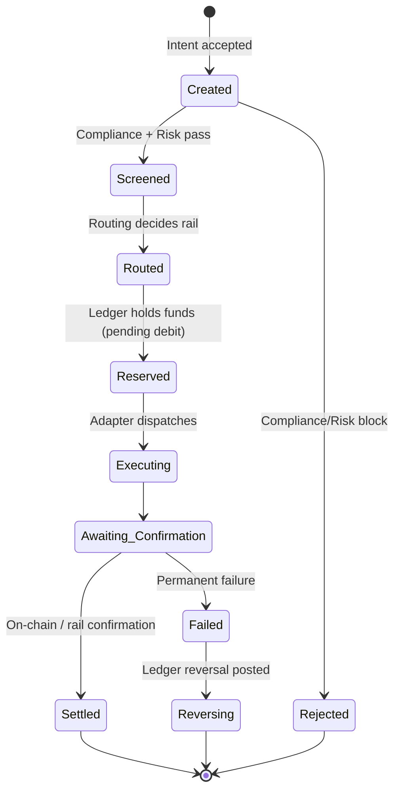
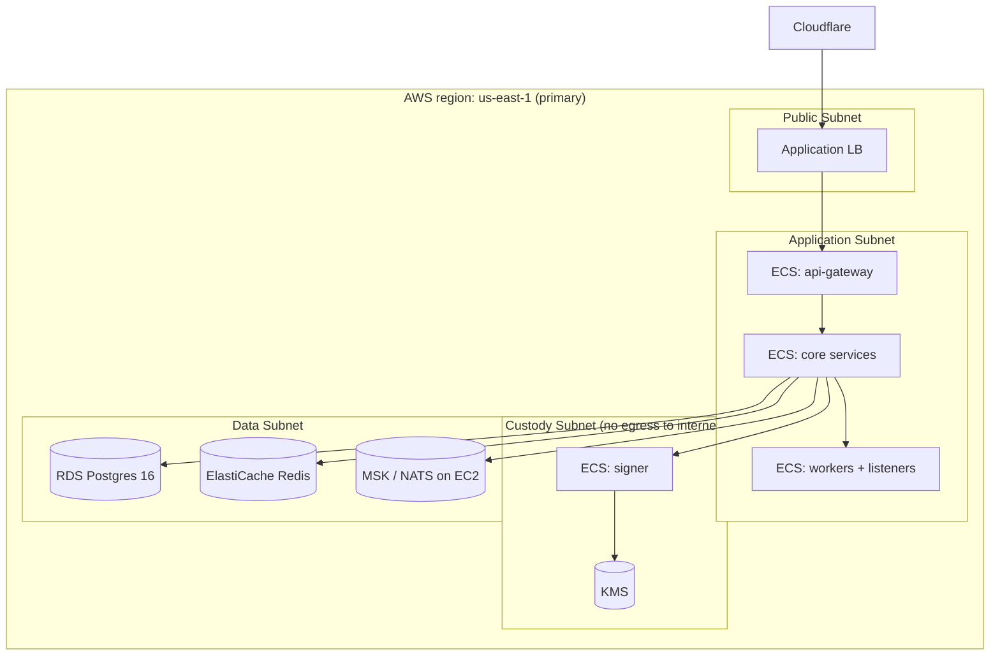

# SalyChain — System Architecture

> **Status:** Living document. Version 0.1 (Foundation slice).
> **Owners:** Platform Architecture
> **Last updated:** 2026-05-28

---

## 1. North Star

SalyChain is an **intent-based financial execution network**. A user (or an AI agent) expresses **what** they want financially; SalyChain decides **how** to execute it across blockchains, fiat rails, and internal ledgers — invisibly.

```
                     ┌────────────────────────────┐
                     │           USER             │
                     │  "Send ₦50,000 to John"    │
                     └─────────────┬──────────────┘
                                   │
                                   ▼
                     ┌────────────────────────────┐
                     │        SALY AI             │
                     │  (intent extraction, NLU)  │
                     └─────────────┬──────────────┘
                                   │ Intent JSON
                                   ▼
                     ┌────────────────────────────┐
                     │       SALYCHAIN            │
                     │  Routing · Liquidity ·     │
                     │  Compliance · Execution    │
                     │  · Ledger · Settlement     │
                     └─────────────┬──────────────┘
                                   ▼
              ┌──────────┬──────────┬──────────┬──────────┐
              │   Base   │   XRPL   │  Fiat    │ Internal │
              │  (USDC)  │  (XRP)   │  Rails   │  Ledger  │
              └──────────┴──────────┴──────────┴──────────┘
```

---

## 2. Architectural Principles

| # | Principle | Why |
|---|---|---|
| 1 | **Intent over instruction** | Users express outcomes, not transactions. |
| 2 | **Append-only, double-entry truth** | The ledger is the source of truth, not any chain. |
| 3 | **Idempotency everywhere** | Every mutating API requires an idempotency key. |
| 4 | **Money as integers** | Amounts are `BIGINT` minor units in code & wire; never `float`/`decimal` in application layer. |
| 5 | **Custody isolation** | Private keys live behind a network boundary in the signer service, backed by KMS/MPC. |
| 6 | **Chain-agnostic core** | Business logic is chain-agnostic; chains are adapters. |
| 7 | **Event-sourced state** | Domain events on NATS JetStream are the integration substrate. |
| 8 | **Tracing is non-optional** | Every request carries a `trace_id` and `correlation_id` end-to-end. |
| 9 | **Defense in depth** | Auth at edge, RBAC at service, row-level scope in DB, audit log on every write. |
| 10 | **No mocks in production paths** | Adapters either fully implement an interface or fail loudly. |

---

## 3. High-Level System Diagram



---

## 4. Service Catalog

| Service | Tech | Responsibility | Persists |
|---|---|---|---|
| `api-gateway` | NestJS | AuthN/Z, rate limit, request routing, idempotency cache | Redis |
| `intent` | NestJS | Validates intents, normalizes currencies/amounts, attaches metadata | Postgres |
| `routing` | NestJS | Decides rail (Base / XRPL / fiat / internal), evaluates cost & time | Postgres + Redis |
| `liquidity` | NestJS | Quotes, FX, multi-hop swap planning, slippage protection | Postgres + Redis |
| `execution` | NestJS | Orchestrates the transaction state machine, retries, settlement tracking | Postgres + NATS |
| `ledger` | NestJS | Double-entry postings, balance projections, reconciliation | Postgres |
| `wallet` | NestJS | Wallet provisioning, address book, derivation, broadcasting | Postgres |
| `signer` | NestJS (isolated) | Signs transactions using KMS/MPC; never returns keys | (no PII; encrypted material via KMS) |
| `compliance` | NestJS | KYC/KYB orchestration, sanctions/PEP screening, case mgmt | Postgres |
| `risk` | NestJS | Behavioral scoring, velocity, anomaly detection | Postgres + Redis |
| `notification` | NestJS | Email/SMS/Push fan-out | Postgres |
| `webhook` | NestJS | Outbound webhook delivery (signed, retried, replayable) | Postgres |
| `chain-listener-base` | Node worker | Subscribes to Base events; checkpoints | Postgres |
| `chain-listener-xrpl` | Node worker | Subscribes to XRPL ledger close events; checkpoints | Postgres |
| `admin` | Next.js 15 | Super Admin Dashboard | — |
| `business` | Next.js 15 | Business Dashboard | — |
| `developer-portal` | Next.js 15 | API docs, sandbox, keys | — |

---

## 5. The Internal Ledger (canonical truth)

Double-entry, append-only. The on-chain state is **evidence**, not truth — the ledger is.



**Invariant:** For every `JOURNAL_ENTRY`, `SUM(postings.amount_minor WHERE direction='DEBIT') == SUM(postings.amount_minor WHERE direction='CREDIT')` per currency. Enforced in a DB transaction with a `CHECK` via trigger.

---

## 6. Transaction Lifecycle



Each transition emits a domain event on NATS:
`salychain.tx.created`, `salychain.tx.routed`, `salychain.tx.executing`, `salychain.tx.settled`, `salychain.tx.failed`, `salychain.tx.reversed`.

---

## 7. Intent Schema (v1)

Shared between Saly AI and SalyChain via `@salychain/intent-schema` (Zod).

```jsonc
{
  "version": "1",
  "intent_id": "itn_01HX...",       // ULID
  "kind": "TRANSFER",                // TRANSFER | SWAP | PAYOUT | INVOICE | PAYROLL | AGENT_PAY
  "actor": {
    "type": "USER",                  // USER | BUSINESS | AGENT
    "id": "usr_..."
  },
  "source": {
    "currency": "NGN",
    "amount_minor": 5000000,         // ₦50,000.00
    "account_ref": "wal_..."         // optional
  },
  "destination": {
    "currency": "GHS",               // may equal source
    "beneficiary": {
      "kind": "PHONE",               // PHONE | WALLET | BANK | EMAIL | HANDLE
      "value": "+233..."
    }
  },
  "constraints": {
    "max_fee_minor": 50000,
    "max_slippage_bps": 30,
    "deadline_at": "2026-05-28T12:00:00Z"
  },
  "context": {
    "channel": "WHATSAPP",
    "trace_id": "..."
  }
}
```

---

## 8. Deployment Topology



**Multi-region readiness:** Postgres logical replication to `us-west-2`; NATS mirrored; signer is region-local (keys never replicated outside region).

---

## 9. Security Model

| Layer | Control |
|---|---|
| Edge | Cloudflare WAF, bot scoring, geo rules, mTLS for partners |
| API | OAuth2 + JWT (user), HMAC API keys (B2B), per-key scopes, per-key rate limits |
| Service | RBAC via CASL, signed inter-service requests (JWT with `aud`), mTLS in mesh |
| Data | Row-level scope (tenant_id), column-level encryption for PII (AES-256 via KMS) |
| Custody | Network-isolated signer; KMS-wrapped key material; allowlist of destinations per wallet |
| Operations | Just-in-time access (AWS SSO + break-glass), full audit log, change requests via PRs |
| Supply chain | Pinned deps, `pnpm audit` in CI, SBOM (CycloneDX), signed container images (cosign) |

---

## 10. Folder Structure

```
SalyChain/
├── apps/
│   ├── admin/                # Super Admin Dashboard (Next.js 15)
│   ├── business/             # Business Dashboard (Next.js 15)
│   └── developer-portal/     # API docs + sandbox [later]
├── services/
│   ├── api-gateway/
│   ├── intent/
│   ├── routing/
│   ├── liquidity/
│   ├── execution/
│   ├── ledger/
│   ├── wallet/
│   ├── signer/
│   ├── compliance/
│   ├── risk/
│   ├── notification/
│   ├── webhook/
│   └── workers/
│       ├── chain-listener-base/
│       └── chain-listener-xrpl/
├── packages/
│   ├── types/                # Shared TS types
│   ├── config/               # Env loaders, schema-validated
│   ├── logger/               # Winston + OTEL bridge
│   ├── errors/               # Typed domain errors
│   ├── money/                # Integer money helpers
│   ├── intent-schema/        # Zod schemas, shared with Saly AI
│   ├── sdk-internal/         # Inter-service client
│   ├── ui/                   # Design system (Tailwind preset + ShadCN tokens)
│   └── eslint-config/        # Shared lint preset
├── contracts/
│   ├── base/                 # Hardhat workspace for Base contracts
│   └── shared/               # Common Solidity libraries
├── infra/
│   ├── docker/               # Local Dockerfiles + compose
│   ├── terraform/            # AWS infra (later)
│   └── k8s/                  # Helm charts (later)
├── docs/
│   ├── ARCHITECTURE.md
│   ├── adr/                  # Architecture Decision Records
│   └── runbooks/
├── package.json
├── pnpm-workspace.yaml
├── turbo.json
└── README.md
```

---

## 11. Roadmap Slices

| Slice | Includes | Exit criteria |
|---|---|---|
| **S0 — Foundation** ✅ | Monorepo, infra compose, shared packages, design system, dashboard shell | `pnpm dev` boots all infra + admin shell |
| **S1 — Money core** ✅ | ledger, wallet, signer (KMS-backed), Base adapter, execution state machine, chain listener, admin live data | Internal transfer + Base USDC transfer end-to-end (see [runbook](runbooks/s1-base-testnet-payout.md)) |
| **S2 — Multi-rail** ✅ | XRPL adapter, routing engine, liquidity v1 (signed quotes), compliance + risk skeletons, intent ingestion, live admin views | Intent → screened → routed → settled across BASE + XRPL (see [runbook](runbooks/s2-xrpl-testnet-payment.md)) |
| **S3 — B2B surface** ✅ | Public API gateway, API keys + orgs, signed webhooks with replay/DLQ, public `@salychain/sdk`, developer portal, escrow contracts (Foundry), XRPL IOU support, fiat rail adapter contract + stub | External partner key → intent submission → settlement → signed webhook delivery (see [runbook](runbooks/s3-partner-onboarding.md)) |
| **S4 — AI native** ✅ | `services/agents` (registry + spending policies + reasoning logs), `services/identity` (users + JWT + delegations), wallet policy enforcement at signer, `INVOICE`/`AGENT_PAY` execution, gateway dual auth (API key + JWT), admin AI Insights | Agent autonomously settles invoice (see [runbook](runbooks/s4-agent-invoice-settlement.md)); high-value approval path in [S4+ runbook](runbooks/s4-agent-high-value-spend-approval.md) |
| **S5 — L3** | OP-Stack sequencer design + spike | Devnet rollup posting to Base testnet — [ADR-0016](adr/0016-op-stack-l3-sequencer-design.md), [runbook](runbooks/s5-l3-devnet-rollup.md) |
| **S9 — Token** | $SALY ERC20 + staking + treasury | Audited contracts, deployed to testnet |

---

## 12. Architecture Decision Records

ADRs live in `docs/adr/`. Initial set:

- [ADR-0001](adr/0001-monorepo-pnpm-turborepo.md) — Monorepo with pnpm + Turborepo
- ADR-0002 — NestJS for all backend services
- ADR-0003 — NATS JetStream for domain events, BullMQ for jobs
- [ADR-0004](adr/0004-money-as-bigint-minor-units.md) — Money represented as BIGINT minor units
- [ADR-0005](adr/0005-custody-isolation.md) — Custody isolated in a separate service behind KMS
- [ADR-0006](adr/0006-execution-state-machine.md) — Explicit transaction state machine in the execution service
- [ADR-0007](adr/0007-nats-jetstream-event-bus.md) — NATS JetStream as the domain event bus
- [ADR-0008](adr/0008-base-as-primary-evm-rail.md) — Base as the primary EVM rail for S1
- [ADR-0009](adr/0009-rail-routing-model.md) — Rail-evaluator routing model (S2)
- [ADR-0010](adr/0010-compliance-and-risk-integration.md) — Compliance + risk are pre-condition services (S2)
- [ADR-0011](adr/0011-xrpl-rail-integration.md) — XRPL native payments as the second rail (S2)
- [ADR-0012](adr/0012-b2b-surface-and-gateway.md) — B2B surface, API gateway, and partner identity (S3)
- [ADR-0013](adr/0013-webhook-delivery-and-signing.md) — Webhook delivery, signing, and delivery semantics (S3)
- [ADR-0014](adr/0014-escrow-contract-primitive.md) — On-chain escrow as a routing primitive (S3)
- [ADR-0015](adr/0015-agent-wallets-and-spending-controls.md) — Agent wallets, spending controls, JWT identity (S4)
- [ADR-0016](adr/0016-op-stack-l3-sequencer-design.md) — OP-Stack L3 sequencer on Base (S5)
