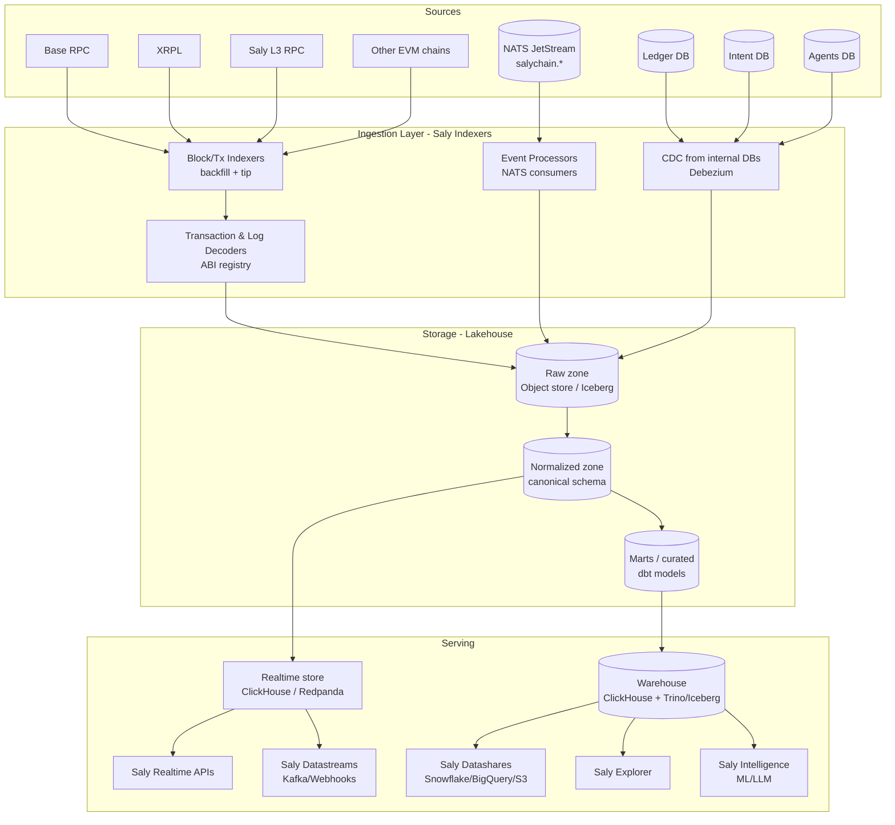

# Phase 3 — Saly Analytics Cloud

> An enterprise blockchain data platform (inspired by Allium) built on top of SalyChain's existing rails and event bus. Turns raw multi-chain activity + SalyChain's own ledger/intent/agent data into **queryable, streamable, AI-ready datasets** and five commercial products.

This design **reuses what already exists**: the chain adapters (`chain-base`, `chain-xrpl`, `chain-l3`), the chain-listener workers, the NATS JetStream bus, and the typed event schemas. It adds the indexing/warehouse/serving layers the audit found **missing**.

---

## 1. Why this fits SalyChain

SalyChain already:
- Decodes on-chain activity (ERC-20 `Transfer`, escrow events, XRPL Payments, L3 transfers, L2 `OutputProposed`) in the listener workers.
- Publishes 24 typed event subjects on JetStream (`salychain.chain.*`, `salychain.tx.*`, `salychain.intent.*`, `salychain.agent.*`).
- Has a double-entry ledger and an intent pipeline — **proprietary data no public explorer has** (intent → rail decision → settlement lineage, agent reasoning, compliance/risk signals).

The differentiated wedge vs Allium/Dune: **SalyChain owns both the chain data and the financial-intent context.** That lineage (why a payment took a rail, what an agent reasoned, how it settled across rails) is a unique dataset.

---

## 2. Reference architecture



### Layer responsibilities

| Layer | Component | Tech (proposed) | Reuses |
|-------|-----------|-----------------|--------|
| Ingestion | Block/tx indexers | Rust/TS workers, checkpointed | existing `chain-*` adapters + listener checkpoint pattern |
| Ingestion | Decoders | ABI registry + viem/ethers decode; XRPL codec | `chain-base/abi.ts`, escrow/dex ABIs |
| Ingestion | Event processors | NATS JetStream durable consumers | `packages/events` `EventBus` |
| Ingestion | CDC | Debezium → Kafka | internal Postgres |
| Storage | Lakehouse | Apache Iceberg on S3 (raw/normalized/marts) | new |
| Transform | Modeling | dbt | new |
| Serving | OLAP warehouse | ClickHouse (hot) + Trino over Iceberg (cold) | new |
| Serving | Realtime | ClickHouse MV + Redpanda/Kafka | new |
| Serving | Catalog/governance | OpenMetadata + access policies | new |

---

## 3. Data normalization layer (canonical schema)

A single cross-chain canonical model so a query works identically across Base/XRPL/L3/future chains.

### Core normalized tables (Iceberg / ClickHouse)

```sql
-- blocks: one row per block per chain
blocks(
  chain_id        LowCardinality(String),  -- 'base-mainnet','xrpl-mainnet','saly-l3'
  block_number    UInt64,
  block_hash      String,
  parent_hash     String,
  ts              DateTime64(3),
  tx_count        UInt32,
  ingested_at     DateTime64(3)
) ENGINE = ReplacingMergeTree ORDER BY (chain_id, block_number);

-- transactions: chain-agnostic tx envelope
transactions(
  chain_id        LowCardinality(String),
  tx_hash         String,
  block_number    UInt64,
  ts              DateTime64(3),
  from_address    String,
  to_address      String,
  value_raw       UInt256,
  status          Enum8('success'=1,'failed'=0),
  fee_raw         UInt256,
  method_id       String,
  decoded         JSON           -- decoded inputs when ABI known
) ENGINE = ReplacingMergeTree ORDER BY (chain_id, block_number, tx_hash);

-- token_transfers: unified ERC-20 / XRPL IOU / native
token_transfers(
  chain_id, tx_hash, log_index UInt32, ts DateTime64(3),
  token_address String, token_symbol LowCardinality(String), token_decimals UInt8,
  from_address String, to_address String,
  amount_raw UInt256, amount_normalized Decimal(38,18),
  transfer_type Enum8('erc20'=1,'native'=2,'xrpl_iou'=3,'xrpl_native'=4)
) ENGINE = MergeTree ORDER BY (chain_id, ts, token_address);

-- decoded_events: any decoded log (escrow, dex, custom)
decoded_events(
  chain_id, tx_hash, log_index UInt32, ts DateTime64(3),
  contract_address String, event_name LowCardinality(String),
  args JSON, abi_id String
) ENGINE = MergeTree ORDER BY (chain_id, ts, contract_address);

-- addresses: enrichment (labels, entity, first/last seen)
addresses(
  chain_id, address String, entity_id String, label String,
  category LowCardinality(String), first_seen DateTime64(3), last_seen DateTime64(3)
) ENGINE = ReplacingMergeTree ORDER BY (chain_id, address);
```

### SalyChain-proprietary marts (the differentiator)

```sql
-- intent_settlement_lineage: intent → rail decision → tx → on-chain settlement
intent_settlement_lineage(
  intent_id, actor_type, actor_id, kind,            -- from intent DB
  selected_rail, route_rationale,                   -- from routing
  execution_tx_id, tx_state,                        -- from execution
  chain_id, settlement_tx_hash, settled_at,         -- from chain data
  source_currency, dest_currency, amount_minor,
  compliance_decision, risk_score                   -- from compliance/risk
);

-- agent_activity: agent spend behavior + reasoning
agent_activity(agent_id, owner_id, intent_id, decision, amount_minor,
  policy_caps JSON, reasoning_steps JSON, approval_votes JSON, ts);

-- rail_economics: cost/speed/success by rail over time
rail_economics(rail, day Date, tx_count UInt64, volume_usd Decimal(38,2),
  avg_settle_secs Float64, success_rate Float64, avg_fee_usd Decimal(18,6));
```

---

## 4. Ingestion: indexers, decoders, event processors

### 4.1 Blockchain indexers (`packages/analytics-indexer` — new)
- **Backfill mode:** range-scan historical blocks (parallel by block range, idempotent upserts).
- **Tip mode:** follow head with confirmation lag + reorg handling (re-pull on parent-hash mismatch).
- **Checkpointing:** reuse the worker checkpoint pattern (per-chain cursor table) already used by `chain-listener-base`.
- **Multi-chain:** driver interface so Base/L3 share EVM logic; XRPL has its own driver.

```ts
interface ChainIndexer {
  chainId: string;
  getHead(): Promise<number>;
  fetchBlock(n: number): Promise<RawBlock>;       // tx + receipts + logs
  detectReorg(n: number, knownHash: string): Promise<boolean>;
}
// EvmIndexer implements via viem (reuse chain-base/chain-l3 clients)
// XrplIndexer implements via xrpl.js (reuse chain-xrpl getPayments/ledger)
```

### 4.2 Transaction & log decoders (`packages/analytics-decoder` — new)
- **ABI registry** keyed by `(chain_id, contract_address)` → ABI (seed from `contract-registry` + chain-base ABIs: ERC-20, SalyEscrow, Uniswap V3).
- **Method/event decode** via viem `decodeFunctionData` / `decodeEventLog`; fall back to `method_id` + raw.
- **Protocol modules:** ERC-20 transfers, Uniswap V3 swaps, SalyEscrow deals, XRPL Payment/TrustSet.

### 4.3 Event processors (`services/analytics-ingest` — new)
- Durable JetStream consumers on `salychain.chain.>`, `salychain.tx.>`, `salychain.intent.>`, `salychain.agent.>`.
- Each event → normalized row(s) in the raw zone (exactly-once via event_id dedupe).
- This is the **realtime spine** — the same events that drive settlement also drive analytics, so realtime datasets are seconds-fresh.

### 4.4 CDC for internal financial data
- Debezium on `salychain_ledger`, `salychain_intent`, `salychain_execution`, `salychain_agents`, `salychain_routing` → Kafka → raw zone. Powers the proprietary lineage marts without touching service DBs at query time.

---

## 5. Cross-chain aggregation, historical & realtime datasets

| Dataset class | Definition | Freshness | Store |
|---------------|-----------|-----------|-------|
| **Historical** | Full backfilled blocks/tx/transfers/events per chain | Batch (hourly dbt) | Iceberg + Trino |
| **Realtime** | Tip-following transfers, tx lifecycle, intent/agent events | Seconds | ClickHouse MV / Redpanda |
| **Curated marts** | rail_economics, intent_settlement_lineage, token flows, address labels | Hourly/daily | ClickHouse |
| **AI-ready** | Feature tables (denormalized, point-in-time-correct) + embeddings | Daily + streaming features | Iceberg + vector store |

**Cross-chain aggregation examples (work identically across chains):**
- Token flow graph (who→whom, by entity) across Base + L3.
- Stablecoin (USDC) supply/velocity across all rails including XRPL IOU + L3.
- Unified "entity activity" joining `addresses.entity_id` across chains.

---

## 6. Data warehouse connectors & AI-ready datasets

- **Warehouse connectors:** Saly Datashares export to **Snowflake** (Secure Data Share), **BigQuery** (Analytics Hub), **Databricks** (Delta Share), and **S3/Parquet** drops. Iceberg as the interchange format keeps copies cheap.
- **AI-ready datasets:**
  - Point-in-time feature tables (no leakage) for risk/fraud models — feeds the missing ML layer from Phase 1.
  - Text corpora from agent reasoning logs + intent context for LLM fine-tuning/RAG.
  - Vector embeddings of addresses/entities for similarity (clustering, entity resolution).
  - A documented **semantic layer** (dbt metrics) so LLMs/agents can query metrics safely via tools.

---

## 7. The five products

### 7.1 Saly Explorer
**What:** Multi-chain block explorer covering Base, XRPL, Saly L3 (the audit found the L3 explorer is currently just a URL). Plus the unique **intent/settlement lineage view** no other explorer has.

| Capability | Detail |
|-----------|--------|
| Search | tx hash, address, block, intent_id, entity |
| Chain coverage | Base, L3, XRPL (extensible) |
| Tx page | decoded calldata, token transfers, escrow/DEX decode, gas/fees |
| **Lineage page** | intent → rail decision → reservation → settlement tx (SalyChain-only) |
| Address/entity | balances, transfers, labels, counterparties |
| L3 | blocks, txs, `OutputProposed` settlement status to Base |
| API | every page backed by Realtime API (below) |

**Build:** Next.js app (`apps/explorer`) reusing `@salychain/ui`; reads ClickHouse via the Realtime API. Replaces the dead `explorer.saly-l3.dev` placeholder.

### 7.2 Saly Datashares
**What:** Governed, query-ready datasets delivered into the customer's own warehouse (Snowflake/BigQuery/Databricks) or as S3/Parquet — Allium Datashares analog.

| Capability | Detail |
|-----------|--------|
| Catalog | Curated tables (transfers, swaps, stablecoin flows, rail_economics, labels) |
| Delivery | Snowflake Secure Share, BigQuery Analytics Hub, Delta Share, S3 |
| Freshness | Daily/hourly, with SLA tiers |
| Governance | Per-share access policy, PII redaction on financial-lineage shares |
| Billing | Per-dataset subscription + volume |

### 7.3 Saly Realtime APIs
**What:** Low-latency REST/GraphQL over ClickHouse for current balances, transfers, tx status, entity activity — Allium Realtime analog.

```
GET  /v1/data/transfers?chain=base-mainnet&token=USDC&from=0x..&limit=100
GET  /v1/data/address/{chain}/{address}/balances
GET  /v1/data/tx/{chain}/{hash}            # decoded + lineage if SalyChain-originated
POST /v1/data/query                        # parameterized, sandboxed SQL (allowlisted)
GET  /v1/data/stablecoin/usdc/supply?window=24h
```
Auth via the **existing gateway** (API keys, scopes, rate limits, idempotency) — extend the gateway with a `data` scope rather than building new auth.

### 7.4 Saly Datastreams
**What:** Push, not pull. Customers subscribe to filtered realtime streams — Allium Datastreams analog.

| Transport | Use case |
|-----------|----------|
| Kafka/Redpanda topic (managed) | High-volume enterprise ingestion |
| Webhook (reuse `services/webhooks`) | "notify me on USDC transfer > $1M to entity X" |
| WebSocket | Live dashboards / trading |

Filters: chain, token, address/entity, amount threshold, event type, intent/agent activity. Reuses the HMAC-signed webhook delivery + DLQ already built.

### 7.5 Saly Intelligence
**What:** The ML/LLM product layer on top of the datasets — Allium's analytics/intelligence analog, supercharged by intent+agent context.

| Capability | Detail | Reuses |
|-----------|--------|--------|
| Entity resolution & labeling | cluster addresses → entities | embeddings dataset |
| Risk/fraud scoring | ML models on point-in-time features | feeds `services/risk` |
| Stablecoin & flow analytics | supply, velocity, concentration | marts |
| Anomaly detection | wash trading, structuring, agent collusion | streaming features |
| **Natural-language analytics** | LLM + semantic layer + tool-calling over datasets | intent-schema patterns |
| AML/compliance intelligence | typologies, sanctioned-flow tracing | compliance data |

---

## 8. Monetization

| Product | Model | Tiers |
|---------|-------|-------|
| Explorer | Freemium (public) + Pro (API, lineage, exports) | Free / Pro / Enterprise |
| Datashares | Per-dataset subscription + volume | by dataset + freshness SLA |
| Realtime APIs | Usage-based (req/mo) + rate tier | Dev / Growth / Enterprise |
| Datastreams | Throughput-based (events/mo, topics) | by volume |
| Intelligence | Seat + query + model-inference | Team / Enterprise |

Billing integrates with `apikeys` (metering by key/scope) and the gateway request-log (already records per-request usage) → a metering pipeline into the warehouse.

---

## 9. Build sequence (incremental, reuse-first)

| Step | Deliverable | Reuses |
|------|------------|--------|
| 1 | `analytics-ingest` service consuming existing NATS events → ClickHouse | `packages/events`, listeners |
| 2 | Canonical schema + dbt marts (`rail_economics`, lineage) | ledger/intent/routing data |
| 3 | Realtime API behind gateway (`data` scope) | gateway auth |
| 4 | Saly Explorer app (Base/L3/XRPL + lineage) | `@salychain/ui`, Realtime API |
| 5 | Backfill indexers (historical) + Iceberg/Trino | chain adapters |
| 6 | Datastreams (webhook + Kafka) | `services/webhooks` |
| 7 | Datashares (Snowflake/BigQuery/Delta) | Iceberg |
| 8 | Intelligence (entity resolution, risk ML, NL analytics) | AI-ready datasets |

Detailed schemas, k8s, and rollout for these land in [Phase 5](05-technical-implementation.md). Industry-specific datasets that ride this platform are in [Phase 4](04-industry-expansion.md).
