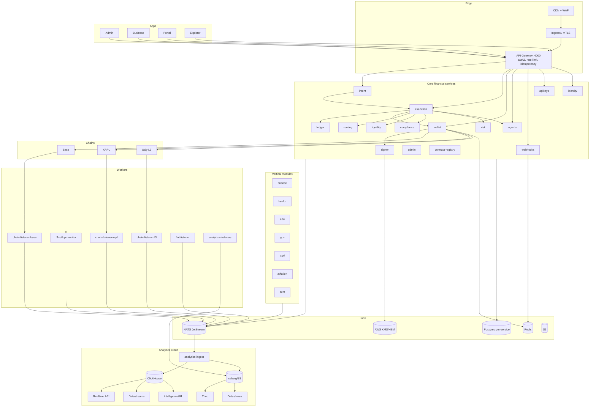

# Phase 5 — Technical Implementation & Roadmap

> Production-grade architecture for SalyChain as a billion-dollar blockchain infrastructure company: system & microservices architecture, database & event design, Kubernetes deployment, CI/CD, monitoring, and security — plus a phased implementation roadmap that closes every gap the [Phase 1 audit](../audit/01-feature-audit.md) found.

This builds on what exists (16 services, NATS event bus, per-service Postgres, chain adapters, KMS signer) and specifies what to add (analytics platform, native stablecoin, observability, full deploy, governance).

---

## 1. Target system architecture



**Architecture tenets (inherited + enforced):** money as integer minor units; idempotency on every mutation; custody isolation (keys only in signer/KMS); append-only ledger with DB-enforced double-entry; trace/correlation IDs end-to-end; typed errors; no stubs on production paths (fail-closed).

---

## 2. Microservices architecture

### 2.1 Service taxonomy & blast-radius groups

| Group | Services | Isolation |
|-------|----------|-----------|
| **Custody (Tier 0)** | signer | Dedicated namespace, dedicated DB cluster, KMS IAM, strict NetworkPolicy, no inbound except wallet |
| **Money (Tier 1)** | ledger, wallet, execution | Own DB cluster; HA; PodDisruptionBudgets |
| **Orchestration (Tier 1)** | intent, routing, liquidity | Stateless, autoscaled |
| **Risk/Compliance (Tier 1)** | compliance, risk | Vendor egress allowlist |
| **Platform (Tier 2)** | gateway, apikeys, webhooks, agents, identity, admin, contract-registry | Standard |
| **Verticals (Tier 2)** | finance, health, edu, gov, agri, aviation, scm | Per-module DB |
| **Workers (Tier 1/2)** | chain-listener-*, l3-rollup-monitor, fiat-listener, analytics-* | Singletons w/ leader election |
| **Data (Tier 2)** | analytics-ingest, realtime-api, datastreams, intelligence | Read-scaled |

### 2.2 Communication
- **Sync:** typed HTTP via `@salychain/sdk-internal` (retries, idempotency, correlation IDs) — already in place.
- **Async:** NATS JetStream (`@salychain/events`) — durable consumers, at-least-once + dedupe by `event_id`.
- **Service mesh (add):** Istio/Linkerd for mTLS, retries, circuit breaking, traffic shifting.
- **Patterns to harden:** saga/compensation in execution (already a state machine); outbox pattern for reliable event publish from DB transactions (closes the "`INTENT_SCREENED` never published" gap and prevents lost events).

### 2.3 Outbox pattern (fix reliable eventing)
```
service tx: write domain row + write outbox row (same DB tx)
outbox relay: poll outbox → publish to NATS → mark sent
```
Add an `event_outbox` table per event-producing service; a relay (in-process or sidecar) guarantees every state change emits its event exactly once. This fixes both audit gaps (missing intent events, agent events not fanned out).

---

## 3. Database architecture

### 3.1 Topology
- **Pattern:** database-per-service (already enforced; 18 logical DBs). Production = separate managed clusters per blast-radius group.

| Cluster | DBs | Notes |
|---------|-----|-------|
| `rds-custody` | signer | Encrypted, isolated creds, PITR, no shared access |
| `rds-money` | ledger, wallet, execution | HA multi-AZ, PITR, read replicas |
| `rds-platform` | identity, apikeys, webhooks, agents, admin, contract-registry, intent, routing, liquidity, compliance, risk, gateway | Grouped |
| `rds-verticals` | finance, health, edu, gov, agri, aviation, scm | Per-module schemas |
| `clickhouse` | analytics (OLAP) | Sharded + replicated |
| `iceberg/s3` | data lake | raw/normalized/marts zones |

### 3.2 Conventions
- Prisma migrations per service (`prisma migrate deploy` in CI/CD), money as `BIGINT`/string minor units, append-only where financial, DB CONSTRAINT TRIGGER enforcing double-entry (already in ledger).
- Add: row-level encryption for PII columns; `pgcrypto` already used in ledger.

### 3.3 New schema (illustrative) — analytics + outbox
```sql
-- per producer service
CREATE TABLE event_outbox (
  id UUID PRIMARY KEY DEFAULT gen_random_uuid(),
  subject TEXT NOT NULL, payload JSONB NOT NULL,
  correlation_id TEXT, trace_id TEXT,
  created_at TIMESTAMPTZ DEFAULT now(),
  sent_at TIMESTAMPTZ
);
CREATE INDEX ON event_outbox (sent_at) WHERE sent_at IS NULL;
```
(ClickHouse canonical tables are specified in [Phase 3 §3](03-saly-analytics-cloud.md).)

### 3.4 Native stablecoin schema (closes Phase 1 gap)
```sql
-- service: stablecoin
reserve_account(id, custodian, currency, balance_minor, attestation_url, as_of)
mint_request(id, requester_org, amount_minor, reserve_ref, status, chain, tx_hash)
redeem_request(id, holder, amount_minor, payout_rail, status)
supply_snapshot(chain, total_minor, ts)  -- reconciled vs reserves
```
Contract: `SalySD` (ERC-20, pausable, blocklist, mint/burn gated by reserve oracle + role) deployed on L3/Base, with proof-of-reserves attestations anchored via `SalyAttestationRegistry`.

---

## 4. Event architecture

### 4.1 Current (real) + additions
- Streams: `SALYCHAIN_TX`, `SALYCHAIN_CHAIN`, `SALYCHAIN_INTENT`, `SALYCHAIN_AGENT` (exist).
- **Add streams:** `SALYCHAIN_ANALYTICS` (derived), `SALYCHAIN_VERTICAL` (domain events), `SALYCHAIN_STABLECOIN`.
- **Fix:** publish `INTENT_SCREENED`/`INTENT_ROUTED` (via outbox); fan agent events into webhooks.

### 4.2 Event governance
- Schema registry: `packages/events` is the source of truth; add CI check that every `SUBJECT` has a Zod schema + at least one producer or is marked reserved.
- Versioning: additive within major; `EVENT_SCHEMA_VERSION` already present.
- Consumers: durable, idempotent (dedupe by `event_id`), DLQ + replay (webhooks already model this).

### 4.3 Delivery guarantees
| Path | Guarantee |
|------|-----------|
| Domain state → event | Exactly-once publish via outbox |
| Event → consumer | At-least-once + idempotent handler |
| Event → partner webhook | At-least-once, HMAC-signed, ret/DLQ/replay (exists) |
| Event → analytics | At-least-once + ClickHouse dedupe (ReplacingMergeTree) |

---

## 5. Kubernetes deployment plan

The audit found only a `fiat-listener` manifest. Target: full GitOps-managed cluster.

### 5.1 Cluster layout
```
EKS (multi-AZ)
├── namespace: salychain-custody     # signer only; IRSA→KMS; deny-all NetworkPolicy except wallet
├── namespace: salychain-money       # ledger, wallet, execution
├── namespace: salychain-platform    # gateway, identity, apikeys, webhooks, agents, admin, registry, intent, routing, liquidity, compliance, risk
├── namespace: salychain-verticals   # finance, health, edu, gov, agri, aviation, scm
├── namespace: salychain-workers     # listeners, monitor, fiat-listener, analytics indexers (leader-elected)
├── namespace: salychain-data        # analytics-ingest, realtime-api, datastreams, intelligence, clickhouse
├── namespace: salychain-apps        # admin, business, portal, explorer (or on Vercel/edge)
└── namespace: salychain-observability # prometheus, grafana, loki, tempo, alertmanager, otel-collector
```

### 5.2 Per-service manifest standard (Helm chart template)
Every service ships: `Deployment` (resources, probes on `/v1/health`, `securityContext` non-root), `Service`, `HorizontalPodAutoscaler`, `PodDisruptionBudget`, `NetworkPolicy`, `ServiceAccount` (IRSA where needed), `ConfigMap` + `ExternalSecret` (from AWS Secrets Manager). Singleton workers use `Deployment` replicas=1 + lease-based leader election (or `StatefulSet`).

```yaml
# helm/charts/saly-service/templates/deployment.yaml (excerpt)
livenessProbe:  { httpGet: { path: /v1/health, port: http }, initialDelaySeconds: 15 }
readinessProbe: { httpGet: { path: /v1/health, port: http }, periodSeconds: 10 }
securityContext: { runAsNonRoot: true, readOnlyRootFilesystem: true, allowPrivilegeEscalation: false }
resources: { requests: { cpu: 100m, memory: 256Mi }, limits: { cpu: "1", memory: 512Mi } }
```
> Note: services use global prefix `/v1`, so probes must hit `/v1/health` (not `/health`) — an audit finding.

### 5.3 Build artifacts (close the gap)
- **Dockerfiles for all** services/workers/apps (only 5 exist). Standardize multi-stage Node 20 Alpine + pnpm + tini (pattern already in execution/ledger/signer).
- Apps: containerized Next.js or deploy to Vercel/edge.

### 5.4 GitOps
- ArgoCD/Flux watching a `deploy/` repo; Helm umbrella chart per environment (staging/prod); image tags promoted by CI.
- Progressive delivery (Argo Rollouts) for canary on money services.

---

## 6. CI/CD pipeline

Current CI runs format/typecheck/unit + partial migrate smoke; **missing** lint, e2e, contract tests, deploy. Target pipeline:

```mermaid
flowchart LR
  PR[PR] --> Q[quality: format, lint, typecheck]
  Q --> UT[unit + integration (Testcontainers)]
  UT --> SC[forge test: escrow, token]
  SC --> SMK[smoke: health + @payments]
  SMK --> SEC[security: pnpm audit, semgrep, ZAP baseline]
  SEC --> BLD[build + push images ghcr/ECR]
  BLD --> MIG[prisma-deploy-all on staging]
  MIG --> DEPs[deploy staging via Argo]
  DEPs --> E2E[Playwright + API e2e on staging]
  E2E --> LOAD[k6 nightly]
  E2E --> PROM[promote → prod canary]
```

### 6.1 Concrete additions to `.github/workflows/`
| Workflow | Adds |
|----------|------|
| `ci.yml` (extend) | `pnpm lint`; full `scripts/prisma-deploy-all.sh`; integration tests |
| `contracts.yml` | `forge test` + `forge fmt --check` + slither for escrow & token |
| `security.yml` | `pnpm audit --prod`, semgrep, ZAP baseline against staging gateway |
| `images.yml` | matrix build/push Dockerfiles for all services/apps |
| `deploy.yml` | Argo sync staging → e2e gate → prod canary (manual approval) |
| `e2e.yml` | Playwright (apps) + API smoke runner on ephemeral env |
| `load.yml` (nightly) | k6 SLO thresholds |

### 6.2 Quality gates (block merge/release)
typecheck + lint + unit + integration + contract tests green; security audit ≤ high; smoke `@critical` green; coverage thresholds on money paths; migration deploy succeeds.

---

## 7. Monitoring & observability architecture

The audit confirmed Prometheus/Grafana/Loki/OTEL collector containers exist but **no service exposes `/metrics` and no traces are exported** (hence the 404s). This is the highest-priority operational gap for a money platform.

### 7.1 Instrumentation (add to every service)
- **Metrics:** add `prom-client` (or `@willsoto/nestjs-prometheus`) → expose `/metrics`. Standard RED metrics (rate/errors/duration) + domain metrics: `ledger_postings_total`, `ledger_imbalance_detected_total`, `tx_state_transitions_total{state}`, `signer_sign_total{outcome}`, `chain_listener_lag_blocks{chain}`, `webhook_delivery_failures_total`, `quote_stub_fallback_total`.
- **Tracing:** OpenTelemetry SDK bootstrap in each service; export OTLP → collector → Tempo/Jaeger. Propagate existing `trace_id`/`correlation_id`.
- **Logs:** pino → stdout → Loki (logger already structured + redacting secrets).
- **Fix scrape:** Prometheus already targets `:4000-4003,4099/metrics`; extend to all services + use `/metrics` at root (not under `/v1`), or adjust `setGlobalPrefix` exclusions.

### 7.2 Dashboards (Grafana, provisioned as code)
Platform health (RED per service), Money (volume by rail, settle latency, success rate, **ledger balance invariant**), Custody (signer rate/errors/KMS latency), Chains (listener lag, reorgs, confirmation time), Webhooks (delivery/DLQ), Business KPIs (GMV, active orgs/agents).

### 7.3 Alerting (Alertmanager / Grafana alerts)
| Severity | Alert |
|----------|-------|
| **Page** | ledger imbalance detected; signer error rate > 1%; settlement stalled (no `tx.settled` in N min while inflight>0); chain listener lag > threshold; KMS unavailable |
| **Page** | gateway 5xx spike; DB connection saturation; NATS consumer lag growing |
| **Ticket** | webhook DLQ growth; stub fallback in prod; quote staleness; cert/secret expiry |

### 7.4 SLOs
| Service | SLO |
|---------|-----|
| Gateway availability | 99.95% |
| Intent submit p95 | < 300 ms |
| Internal settle p95 | < 2 s |
| Signer sign p95 | < 150 ms |
| Chain confirmation (Base) | < 2 blocks of finality target |
| Webhook delivery success | > 99.5% (24h) |

---

## 8. Security architecture

### 8.1 Custody (highest stakes)
- Signer in isolated namespace; AWS KMS CMK via IRSA (terraform module exists); **forbid `KMS_PROVIDER=local` in prod** (startup assertion). Roadmap: CloudHSM, key ceremony, dual-control, per-key rotation runbook (signer `kms:rewrap` exists).
- Policy-gated signing already enforced; add anomaly detection on sign volume.

### 8.2 Network & access
- mTLS via service mesh; default-deny NetworkPolicies; custody reachable only from wallet.
- Edge: WAF + rate limiting (gateway also app-rate-limits); PSP IP allowlists for inbound webhooks (signatures already verified).
- Per-request JWT validation at edge (audit found apps trust cookie presence) — validate against identity/JWKS in middleware.

### 8.3 Data protection
- Secrets in AWS Secrets Manager via External Secrets (no env secrets in images); rotation.
- PII off-chain + encrypted; on-chain only hashes (attestation pattern, Phase 4). Field-level encryption for KYC data; document storage (S3) with SSE-KMS, currently uploads are metadata-only — add real encrypted blob storage.
- DB encryption at rest + in transit; column encryption for sensitive fields.

### 8.4 AppSec & compliance
- SAST (semgrep), dependency audit, container scanning (Trivy), IaC scanning (tfsec/checkov), contract analysis (slither) in CI.
- Authz matrix tests (Phase 2); idempotency abuse tests; signer-isolation tests.
- Compliance posture: SOC 2 / ISO 27001 controls mapping; sanctions/KYC must use real vendors in prod (fail-closed, not embedded list); audit logs immutable (exist).

### 8.5 Threat model highlights
| Threat | Mitigation |
|--------|-----------|
| Key compromise | KMS/HSM, isolation, policy gating, rotation, anomaly alerts |
| Double-spend / replay | Idempotency + ledger reservation + DB constraints |
| Webhook spoofing | HMAC verify + timestamp tolerance |
| Reorg / chain instability | Confirmation lag, checkpoint resume, finality policy |
| Stub-in-prod | Fail-closed config validation + `quote_stub_fallback_total` alert |
| Insider | RBAC + audit + dual-control on custody/governance |

---

## 9. Governance architecture (close gap)

- **On-chain governance:** `SalyGovernor` (OpenZeppelin Governor) + `Timelock` controlling protocol params, treasury, and `contract-registry`-tracked contract pause/upgrade (today DB-only/simulated). `$SALY` (exists, with launch switch) becomes the governance token; staking can grant voting weight.
- **Multisig:** Safe for treasury + emergency pause (escrow resolver, stablecoin pause) — replaces simulated multisig in contract-registry.
- **Process:** proposal → vote → timelock → execute, with the registry recording on-chain execution receipts (not just DB rows).

---

## 10. Implementation roadmap (gap-closing, sequenced)

> Each milestone is independently shippable and maps to audit gaps. "Now" = current real baseline.

### Milestone A — Operate safely (foundation)
- Add `/metrics` + OTEL tracing to all services; Grafana dashboards + critical alerts (ledger imbalance, settlement stall, signer errors).
- Outbox pattern; publish `INTENT_SCREENED`/`INTENT_ROUTED`; fan agent events to webhooks.
- Fail-closed config (no stub on prod); enforce AWS KMS in prod.
- Dockerfiles for all services/apps; Helm chart; full k8s manifests; ArgoCD.
- CI: add lint, contract tests, integration, security scans, full migrate, smoke.
- **Exit:** can deploy + observe + alert on the full stack in staging.

### Milestone B — Productize data (Saly Analytics Cloud)
- `analytics-ingest` (NATS→ClickHouse), canonical schema, dbt marts (rail_economics, intent lineage).
- Realtime API (gateway `data` scope), Saly Explorer (Base/L3/XRPL + lineage) — replaces placeholder explorer.
- Backfill indexers + Iceberg/Trino; Datastreams (webhook+Kafka); Datashares (Snowflake/BigQuery).
- **Exit:** five Analytics products live; first external data customers.

### Milestone C — Harden money + multi-tenancy
- True multi-tenant org scoping (remove demo-org hardcoding); merchant product (checkout, payment links, settlement reports).
- Real fiat pay-in rail (replace clearing-seed top-up); reconciliation.
- e2e + load + chaos suites green; reorg/finality policies per chain.
- **Exit:** production money movement at scale with real merchants.

### Milestone D — Stablecoin + L3 infra
- Native stablecoin (`SalySD`): mint/redeem, reserves, proof-of-reserves, attestations.
- L3 production: sequencer HA (Conductor), RPC nodes, canonical bridge contracts, explorer integration.
- **Exit:** owned stablecoin + owned L3 rail in production.

### Milestone E — Governance + verticals
- `SalyGovernor` + Timelock + Safe; on-chain contract control via registry.
- Ship verticals by priority: **AI Agents → Finance → Government/Agriculture → Supply Chain/Aviation → Healthcare/Education** (Phase 4 order).
- **Exit:** platform + ecosystem; vertical revenue; decentralizing control.

### Milestone F — Intelligence + scale
- Saly Intelligence (entity resolution, risk/fraud ML, NL analytics) feeding `services/risk`.
- Additional chains (the schema-only ETHEREUM/POLYGON become live), global PSP corridors.
- SOC2/ISO certification; multi-region active-active.
- **Exit:** category-leading blockchain data + execution infrastructure.

---

## 11. Engineering investments summary (what to build vs reuse)

| Build new | Reuse / extend |
|-----------|----------------|
| Analytics platform (indexers, warehouse, 5 products) | chain adapters, listeners, event bus |
| Native stablecoin stack | ledger, wallet, escrow patterns |
| Observability instrumentation | OTEL/Prom/Grafana/Loki containers (exist) |
| Full k8s/Helm/GitOps + all Dockerfiles | 5 existing Dockerfiles, terraform KMS, fiat-listener manifest |
| Governance contracts | `$SALY` token + launch switch, contract-registry |
| Merchant product + multi-tenancy | business app, intents, payouts |
| Vertical modules | intent schema, escrow, attestation pattern, custody |
| L3 production infra | chain-l3 adapter + monitor + network registry |
| Test pyramid (e2e/load/chaos/security) | existing Vitest + Foundry suites |

See the [audit index](../audit/README.md) for how all five phases connect.
