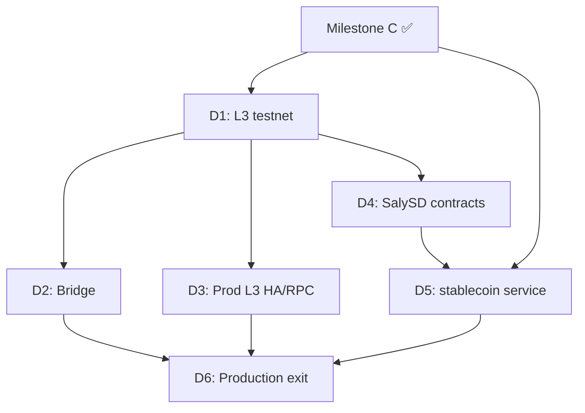

# Milestone D — Stablecoin + L3 production: phased plan

> **Goal:** ship an **owned native stablecoin (`SalySD`)** with reserve-backed mint/redeem, proof-of-reserves attestations, and a **production-grade L3 rail** (testnet → bridge → HA sequencer/RPC).
>
> **Milestone exit (from [roadmap](05-technical-implementation.md)):** owned stablecoin + owned L3 rail in production.

This plan is **reuse-first and security-first**. It builds on S5/S6 (devnet rollup + custodial L3 USDC money rail), Milestone C (tenant isolation, fiat rails, finality/reorg), and Milestone A/B observability + analytics. It closes the audit gaps: no native stablecoin, mock bridge, single-sequencer devnet only.

See the current-state map in [Appendix: current-state grounding](#appendix-current-state-grounding).

---

## Phase overview

| Phase  | Name                              | Headline outcome                                                                 | Status |
| ------ | --------------------------------- | -------------------------------------------------------------------------------- | ------ |
| **D1** | L3 testnet hardening              | Repeatable `saly-testnet` deploy, manifest, verify gate, listener/monitor wired | ✅     |
| **D2** | Canonical L3 ↔ Base bridge        | Real deposit/withdraw; bridge contracts in registry; ledger bridge events        | ✅     |
| **D3** | L3 production infra               | Conductor HA, public RPC fleet, fault-proof path, prod k8s + runbooks            | ✅     |
| **D4** | `SalySD` on-chain primitive       | Pausable, blocklisted, reserve-oracle-gated ERC-20; Foundry tests + ADR            | ✅     |
| **D5** | Stablecoin service + integration  | Mint/redeem/reserves/PoR APIs; execution + ledger wiring; gateway scopes         | ✅     |
| **D6** | Production exit + attestation     | PoR pipeline, supply reconciliation alerts, explorer, external audit, go-live    | ✅     |

Phases are ordered so L3 infrastructure (D1→D3) and stablecoin primitives (D4→D5) can partially overlap, but **D6 requires D2 + D3 + D5**.

---

## D1 — L3 testnet hardening ✅

**Problem (pre-D1):** L3 exists only as a local devnet spike (`845320001`). Testnet chain ID (`845320002`) is defined but has no deploy automation, manifest, or verify gate.

**Planned scope:**

1. **Testnet manifest** — `infra/l3/testnet/deployments.base-sepolia.example.json` + runbook.
2. **Verify gate** — extend `@salychain/chain-l3` exit criteria for `saly-testnet` (oracle, RPC, listener lag).
3. **Worker config** — `L3_NETWORK=saly-testnet` for `chain-listener-l3` + `l3-rollup-monitor`.
4. **Ops** — KMS-backed batcher/proposer keys documented; fail-closed preflight.

**Exit:** `pnpm l3:verify` passes against testnet manifest; listeners + monitor healthy on testnet RPC.

**Shipped:** testnet bootstrap scripts (`pnpm l3:testnet:*`), manifest path resolution, extended `pnpm l3:verify` gate (`l3RailComplete` for `saly-testnet`), runbook [`d1-l3-testnet.md`](../runbooks/d1-l3-testnet.md), worker `L3_NETWORK=saly-testnet` support.

**Deferred:** live testnet op-deployer apply (requires ops keys + staging cluster).

---

## D2 — Canonical L3 ↔ Base bridge ✅

**Problem:** `contract-registry` seeds mock bridge addresses; no deposit/withdraw UX or ledger bridge events.

**Planned scope:**

1. Deploy OP-Stack `OptimismPortal` / standard bridge on Base Sepolia → L3 testnet.
2. Register real addresses in `contract-registry`; deprecate mock seed rows.
3. **Bridge flows:** deposit credit (Base → L3), withdrawal debit (L3 → Base) via wallet/execution.
4. Bridge listener → NATS → ledger postings (`asset.custody.bridge.*` / bridge pending accounts).
5. Admin + explorer bridge status pages.

**Exit:** end-to-end deposit and withdrawal on testnet with ledger reconciliation.

**Depends on:** D1 testnet.

**Shipped:** `@salychain/chain-l3` bridge module (deposit + withdraw calldata, L2 withdrawal indexer), `worker-chain-listener-base-bridge`, L3 withdrawal events on `chain-listener-l3`, wallet `BRIDGE_DEPOSIT`/`BRIDGE_WITHDRAW` broadcast dispatchers, execution `/v1/bridge/*` + multi-leg ledger settlement, contract-registry manifest sync, admin/explorer panels, runbook [`d2-l3-bridge.md`](../runbooks/d2-l3-bridge.md).

**Deferred:** live testnet E2E without deployed portal addresses; fault-proof withdrawal finalization SLA (D3).

---

## D3 — L3 production infra ✅

**Problem:** Single-sequencer devnet compose; Conductor marked `future`; no public RPC fleet.

**Planned scope:**

1. **Conductor** — multi-sequencer leader election (ADR-0016 production target).
2. **RPC fleet** — read replicas, rate limits, health probes.
3. **Fault proofs** — migrate monitor from legacy `L2OutputOracle` to `DisputeGameFactory` path.
4. **Prod k8s** — Helm entries, Dockerfiles for L3 stack, GitOps runbooks.
5. **Alerting** — sequencer lag, batcher failures, output proposal stall.

**Exit:** L3 mainnet (`845320003`) deployable with HA + public RPC; on-call runbook.

**Depends on:** D1 testnet validation, Milestone A GitOps.

**Shipped:** `infra/l3/production/` HA compose (Conductor ×3, geth replicas, fault-proof proposer), `@salychain/worker-l3-rpc-gateway` (read-only rate-limited JSON-RPC), `@salychain/worker-l3-ops-monitor`, dual-mode settlement monitor (`legacy` | `fault_proofs`), `pnpm l3:verify:production`, Helm `infra/helm/l3-stack/`, Prometheus D3 alerts, runbook [`d3-l3-production.md`](../runbooks/d3-l3-production.md).

**Deferred:** live mainnet op-deployer apply (ops keys + production cluster); full OP Conductor image pin validation in CI.

## D4 — `SalySD` on-chain primitive ✅

**Problem:** Only `SalyTestUSDC` (devnet faucet token) and `$SALY` utility token exist. No reserve-gated native stablecoin.

**Planned scope:**

1. **`contracts/salysd/`** — `SalySD` (6-decimal ERC-20, permit, pausable, blocklist, role-gated mint/burn).
2. **`IReserveOracle`** — off-chain attestation sets authorized mint ceiling on-chain.
3. **`ReserveOracle`** — owner-gated attestation updates (production: multisig/timelock).
4. Foundry invariant/fuzz tests; Slither in CI; ADR [`0019-salysd-and-reserves`](../adr/0019-salysd-and-reserves.md).

**Security properties:**

- Mint requires `MINTER_ROLE` **and** `totalSupply + amount ≤ oracle.ceiling`.
- Burn requires `BURNER_ROLE` (redeem unwind only).
- Transfers blocked when paused or blocklisted; mint/burn exempt from pause for treasury ops.
- Two-step ownership; no public faucet on non-devnet.

**Exit:** `forge test --root contracts/salysd` green; contract deployable to L3 testnet.

**✅ Delivered (contracts + ADR):**

- `contracts/salysd/` — `SalySD`, `ReserveOracle`, `IReserveOracle`; 6 Foundry tests; deploy script.
- [ADR-0019](../adr/0019-salysd-and-reserves.md).

**Deferred:** live L3 testnet deploy of SalySD (ops dependency on D1 testnet RPC).

---

## D5 — Stablecoin service + platform integration ✅

**Problem:** No `services/stablecoin`, no mint/redeem lifecycle, no reserve accounts in the money stack.

**Planned scope:**

1. **`services/stablecoin`** (port **4022**, db `salychain_stablecoin`) — schema per [roadmap §3.4](05-technical-implementation.md):
   - `reserve_account`, `mint_request`, `redeem_request`, `supply_snapshot`, `reserve_attestation`
2. **APIs** — org-scoped mint/redeem requests, reserve attestation upload (admin), supply/PoR read.
3. **Events** — `SALYCHAIN_STABLECOIN` stream (`mint_requested`, `mint_completed`, `redeem_*`, `reserve_attested`, `supply_snapshot`).
4. **Execution** — new kinds `SALYSD_MINT` / `SALYSD_REDEEM`; compliance/risk gates; ledger reserve vs circulation accounts.
5. **Gateway** — scopes `stablecoin:read` / `stablecoin:write`; `StablecoinClient` in sdk-internal.
6. **Analytics** — extend supply API with `salysd` + reserve ratio.

**Exit:** org can request mint (compliance-approved → on-chain mint → ledger credit); redeem reverses flow; supply reconciles to reserves.

**Shipped:**

- `services/stablecoin` — mint/redeem/reserves/supply APIs; approve endpoints; `CompletionsService` on `TX_SETTLED`.
- Execution `SALYSD_MINT` / `SALYSD_REDEEM` kinds; `/v1/salysd/*`; reserve vs circulation ledger postings.
- Wallet `SALYSD_MINT` / `SALYSD_REDEEM` / `SALYSD_APPROVE` broadcast dispatchers.
- `@salychain/chain-l3` SalySD ABI + `prepareSalysdMint` / `prepareSalysdBurnFrom`.
- Gateway scopes `stablecoin:read` / `stablecoin:write`; `StablecoinClient`; analytics `GET stablecoin/salysd/supply`.
- Runbook [`d5-salysd-mint-redeem.md`](../runbooks/d5-salysd-mint-redeem.md).

**Deferred:** live testnet E2E (requires deployed SalySD + treasury wallets); fiat payout leg for `FIAT` redeem rail (C2).

---

## D6 — Production exit + attestation ✅

**Problem:** No PoR pipeline, no supply-vs-reserve alerts, no external audit path.

**Planned scope:**

1. **PoR attestation job** — custodian balance → signed attestation → update `ReserveOracle` + optional `SalyAttestationRegistry` anchor.
2. **Supply reconciliation** — on-chain `totalSupply` vs reserve accounts; alert on drift (`salychain_stablecoin_supply_drift`).
3. **Explorer** — SalySD supply, reserve ratio, bridge status, mint/redeem lineage.
4. **Deprecate** `SalyTestUSDC` on testnet/mainnet (devnet only).
5. External audit + prod go-live runbook.

**Exit:** Milestone D criteria met; PoR public; alerts green in staging.

**Depends on:** D2 bridge, D3 prod L3, D5 service.

**✅ Delivered**

- **`packages/stablecoin-por`**: deterministic attestation hashing (keccak256 ABI payload), supply drift / reserve-ratio math, static + HTTP custodian adapters; unit-tested.
- **`services/workers/stablecoin-por`** (metrics **9108**): scheduled PoR pipeline — custodian balance → signed attestation hash → `POST /v1/reserves/attestations` → on-chain `totalSupply` read → supply snapshot → Prometheus gauges (`salychain_stablecoin_supply_drift_minor`, `reserve_ratio_bps`, `attestation_age_seconds`); optional `ReserveOracle.updateAttestation` via wallet `SALYSD_ORACLE_UPDATE`.
- **Public transparency API** (`GET /v1/public/por`, `/mint-requests`, `/redeem-requests` on stablecoin): unauthenticated PoR + org-redacted mint/redeem feed for auditors and explorer.
- **`SalyAttestationRegistry.sol`**: optional on-chain anchor for latest attestation hash + ceiling (Foundry test).
- **`packages/chain-l3`**: `ReserveOracle` ABI helpers, `readSalysdTotalSupply` / `readReserveOracleState`, `prepareReserveOracleUpdate`, `assertSalyTestUsdcDevnetOnly`, `verifyStablecoinExit` + `pnpm stablecoin:verify`.
- **Wallet**: `SALYSD_ORACLE_UPDATE` broadcast kind + dispatcher for on-chain oracle sync.
- **Explorer**: `/l3/salysd` (supply, reserves, ratio, PoR attestation, mint/redeem tables); nav links for SalySD + L3 bridge.
- **Alerts**: `StablecoinSupplyDrift`, `StablecoinAttestationStale`, `StablecoinPorWorkerErrors` in Prometheus rules.
- **Infra**: Helm worker entry, CI/build-images matrix, Prometheus scrape 9108; `deploy-usdc.sh` fails closed off devnet.
- **Runbook**: [`d6-production-exit.md`](../runbooks/d6-production-exit.md) with audit checklist + go-live gate.

**Exit:** Milestone D criteria met; PoR public; alerts green in staging (`pnpm stablecoin:verify`).

**Deferred:** live custodian HTTPS integration (ops-specific URL/credentials); external audit sign-off (process); mainnet oracle owner multisig rotation (ops).

---

## Appendix: current-state grounding

Pre-D1 baseline (from repo audit):

| Capability | Status |
|------------|--------|
| L3 devnet OP-Stack | ✅ `infra/l3/devnet/` |
| Custodial L3 USDC rail | ✅ execution/wallet/routing/listener |
| `SalyTestUSDC` | ✅ devnet only |
| `$SALY` utility token | ✅ not a stablecoin |
| L3 testnet/mainnet deploy | ❌ chain IDs defined, no automation |
| Bridge contracts | ❌ mock registry seed |
| Conductor / HA | ❌ documented as future |
| `SalySD` | ❌ → D4 |
| `services/stablecoin` | ❌ → D5 |
| PoR / attestations | ❌ → D6 |

Next free HTTP port after merchant (4021): **4022** (stablecoin).
