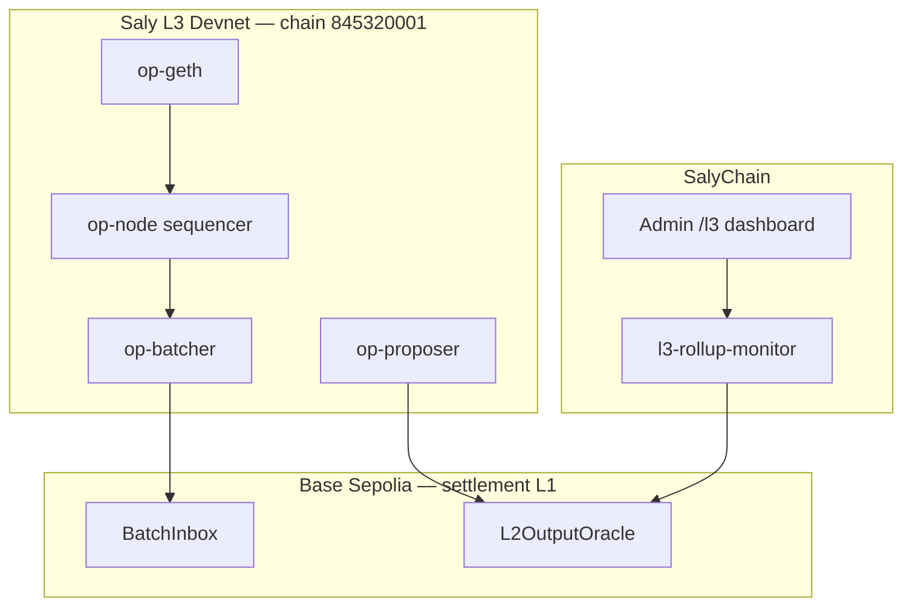

# S5 — L3 OP-Stack devnet rollup (Base Sepolia settlement)

End-to-end spike for **SalyChain L3** posting output roots to **Base Sepolia**, per [ADR-0016](../adr/0016-op-stack-l3-sequencer-design.md) and [ADR-0008](../adr/0008-base-as-primary-evm-rail.md).

## Goal

Deploy an OP-Stack rollup (Saly L3 devnet, chain `845320001`) with Base Sepolia as settlement layer, run batcher + proposer, and observe at least one `L2OutputOracle.OutputProposed` event via SalyChain's `l3-rollup-monitor`.

## Architecture



## Prerequisites

| Requirement                               | Notes                                                        |
| ----------------------------------------- | ------------------------------------------------------------ |
| Base Sepolia ETH                          | Fund **dedicated** batcher + proposer + deployer devnet keys |
| Docker + Compose v2                       | Runs the in-repo OP-Stack (no manual Optimism checkout)      |
| Foundry (`cast`/`forge`), `jq`, `openssl` | Validation + USDC deploy                                     |
| SalyChain stack                           | `pnpm infra:up`, NATS for event emission                     |

> The OP-Stack sequencer now ships in-repo at `infra/l3/devnet` (op-geth, op-node,
> op-batcher, op-proposer) with secured, pinned containers and one-command scripts.
> You no longer clone/build the Optimism monorepo by hand.

## 1. Configure + preflight

```bash
cp infra/l3/devnet/.env.example infra/l3/devnet/.env
# set L1_RPC_URL + funded L3_BATCHER_PRIVATE_KEY / L3_PROPOSER_PRIVATE_KEY (+ deployer)

pnpm l3:bootstrap     # tool check + flow
pnpm l3:preflight     # validates key format, rejects placeholders, asserts funding
```

## 2. Deploy L3 to Base Sepolia

```bash
pnpm l3:deploy
```

This runs op-deployer (containerized), writes `artifacts/genesis.json` +
`artifacts/rollup.json`, and a SalyChain manifest at
`infra/l3/devnet/deployments.base-sepolia.json`:

| Contract       | Manifest key → env var                             |
| -------------- | -------------------------------------------------- |
| L2OutputOracle | `contracts.l2OutputOracle` → `L3_L2_OUTPUT_ORACLE` |
| OptimismPortal | `contracts.optimismPortal` → `L3_OPTIMISM_PORTAL`  |

Copy `L3_L2_OUTPUT_ORACLE` into `infra/l3/devnet/.env`.

## 3. Run the L3 sequencer stack

```bash
pnpm l3:up      # generates the engine JWT, starts the stack, waits for op-geth health
pnpm l3:status  # component health + L3 head + spike exit criteria
```

The stack targets Base Sepolia as L1, L2 chain id `845320001`, and uses calldata DA
by default (no L1 beacon required).

## 4. Configure SalyChain monitor

The monitor + services auto-load the manifest. To run the monitor explicitly:

```bash
# root .env (or rely on the deployments manifest)
L3_NETWORK=saly-devnet
L3_SETTLEMENT_RPC_URL=https://sepolia.base.org
L3_L2_OUTPUT_ORACLE=0xYourOracleAddress
NATS_URL=nats://localhost:4222
```

```bash
pnpm -F @salychain/worker-l3-rollup-monitor dev
```

Expected log when proposer posts:

```text
OutputProposed index=0 l2Block=… root=0x…
```

NATS subject: `salychain.chain.l3.output_proposed`

## 5. Admin dashboard

```bash
pnpm -F @salychain/app-admin dev
```

Open **L3 Rollup** (`/l3`) — shows sequencer design, component checklist, and live output proposal status when `L3_L2_OUTPUT_ORACLE` is set in admin env.

## 6. Verify on Base Sepolia

```bash
cast call $L3_L2_OUTPUT_ORACLE "latestOutputIndex()(uint256)" --rpc-url https://sepolia.base.org

cast logs --from-block latest-5000 \
  --address $L3_L2_OUTPUT_ORACLE \
  'OutputProposed(bytes32,uint256,uint256,uint256)' \
  --rpc-url https://sepolia.base.org
```

## 7. Package tests

```bash
pnpm -F @salychain/chain-l3 test
```

## 8. Verify spike exit criteria

After deploy + proposer + monitor:

```bash
# From repo root — loads infra/l3/devnet/deployments.base-sepolia.json when present
pnpm l3:verify
```

The verifier checks six criteria:

| Check                | Meaning                                                   |
| -------------------- | --------------------------------------------------------- |
| Deploy manifest      | `deployments.base-sepolia.json` or `L3_L2_OUTPUT_ORACLE`  |
| Oracle configured    | Valid L2OutputOracle address                              |
| Settlement RPC       | Base Sepolia reachable                                    |
| Oracle contract      | Bytecode at oracle address                                |
| First OutputProposed | ≥1 output root on-chain                                   |
| Monitor worker       | `GET http://127.0.0.1:4098/health` returns `{ ok: true }` |

Exit code `0` when the first five pass (worker is recommended but not required for `spikeComplete` in CLI — admin dashboard shows all six).

Save deploy output to gitignored manifest:

```bash
cp infra/l3/devnet/deployments.base-sepolia.example.json \
   infra/l3/devnet/deployments.base-sepolia.json
# edit contract addresses + deployed_at
```

## Exit criteria (S5)

- [ ] `rollup.intent.json` deployed with Base Sepolia L1
- [ ] Proposer submits ≥1 output root
- [ ] `l3-rollup-monitor` emits `salychain.chain.l3.output_proposed`
- [ ] Admin `/l3` shows latest proposal

## Out of scope

- L3 wallets in `services/wallet`
- L3 execution rail / routing
- Fault-proof dispute games
- Production sequencer HA (Conductor)

## References

- [ADR-0016](../adr/0016-op-stack-l3-sequencer-design.md)
- [ADR-0008](../adr/0008-base-as-primary-evm-rail.md)
- [Optimism op-deployer docs](https://docs.optimism.io/builders/chain-operators/tools/op-deployer)
- `infra/l3/devnet/README.md`
