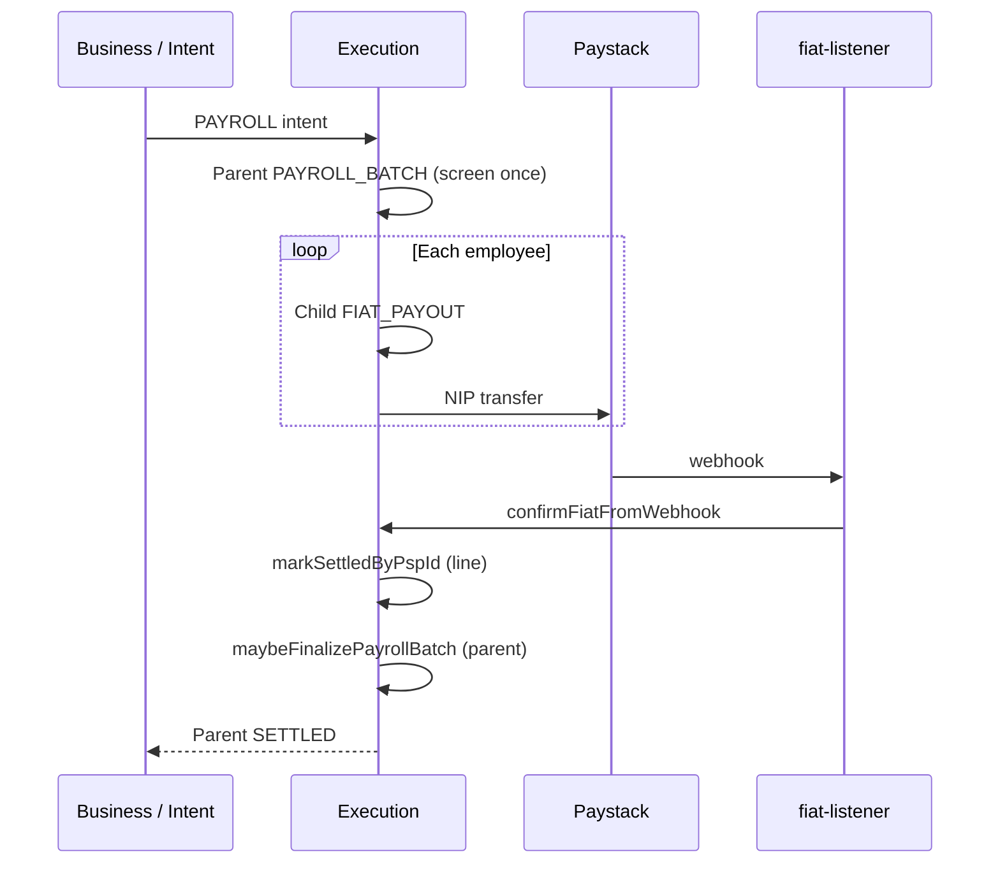

# S6 — Payroll batch (NGN)

End-to-end runbook for **employee payroll batches** via the business dashboard or PAYROLL intent API.

## Prerequisites

Same as fiat payouts ([s5-fiat-payout-ngn.md](./s5-fiat-payout-ngn.md)):

| Component | Requirement |
|-----------|-------------|
| Routing | `ROUTING_FIAT_ENABLED=true` |
| Execution | `FIAT_PSP_PROVIDER=composite` (or `paystack` / `stub`) |
| PSP keys | `PAYSTACK_SECRET_KEY` on execution + routing |
| Webhook | `EXECUTION_INTERNAL_WEBHOOK_TOKEN` + **fiat-listener** running |
| Ledger | `LEDGER_CHAIN_RESERVATION_ENABLED=true` |
| Treasury | Funded NGN business liability account |

## 1. Prod clearing accounts (chart of accounts)

Payroll debits the **business treasury liability**, not a separate payroll-clearing placeholder.

| Account code | Type | Purpose |
|--------------|------|---------|
| `asset.clearing.ngn` | ASSET | Bootstrap source — inbound credits before treasury funding |
| `liability.business.{biz_actor_id}.ngn` | LIABILITY | **Payroll source** — must hold enough NGN for batch total |
| `liability.pending.fiat.ngn` | LIABILITY | In-flight per employee line (reserved at EXECUTING) |
| `asset.custody.fiat.ngn` | ASSET | PSP custody mirror on settlement |

### Bootstrap treasury (production)

```bash
# 1. Create business NGN liability (if not exists)
curl -s -X POST http://localhost:4001/v1/accounts \
  -H 'Content-Type: application/json' \
  -d '{
    "code": "liability.business.biz_01HZJKMNPQRSTVWXYZ0ABCDEFGH.ngn",
    "type": "LIABILITY",
    "currency": "NGN",
    "owner_kind": "BUSINESS",
    "owner_id": "biz_01HZJKMNPQRSTVWXYZ0ABCDEFGH"
  }'

# 2. Credit treasury from clearing (adjust amount for payroll float)
curl -s -X POST http://localhost:4001/v1/journal-entries \
  -H 'Content-Type: application/json' \
  -d '{
    "idempotency_key": "bootstrap-payroll-treasury-ngn",
    "memo": "Seed NGN payroll treasury",
    "postings": [
      { "account_code": "asset.clearing.ngn", "direction": "DEBIT", "amount_minor": "500000000", "currency": "NGN" },
      { "account_code": "liability.business.biz_01HZJKMNPQRSTVWXYZ0ABCDEFGH.ngn", "direction": "CREDIT", "amount_minor": "500000000", "currency": "NGN" }
    ]
  }'
```

## 2. Business dashboard env

```bash
# apps/business/.env
BUSINESS_ACTOR_ID=biz_01HZJKMNPQRSTVWXYZ0ABCDEFGH
# Optional UUID — execution resolves liability.business.{actor}.ngn if omitted
BUSINESS_FIAT_NGN_LEDGER_ACCOUNT=
```

## 3. Submit a payroll batch

### Business UI

1. Open **Payroll** → add employees with bank + amount
2. Submit — redirects to batch detail at `/payroll/{batch_id}`
3. Monitor line progress until parent state becomes **SETTLED**

### API (PAYROLL intent)

```bash
curl -s -X POST http://localhost:4008/v1/intents \
  -H 'Content-Type: application/json' \
  -H 'Idempotency-Key: payroll-demo-1' \
  -d '{
    "intent": {
      "version": "1",
      "intent_id": "itn_payroll_demo",
      "kind": "PAYROLL",
      "actor": { "type": "BUSINESS", "id": "biz_01HZJKMNPQRSTVWXYZ0ABCDEFGH" },
      "source": {
        "account_ref": "liability.business.biz_01HZJKMNPQRSTVWXYZ0ABCDEFGH.ngn",
        "amount": { "amount_minor": "15000000", "currency": "NGN" }
      },
      "destination": {
        "currency": "NGN",
        "beneficiary": {
          "kind": "INTERNAL_ACCOUNT",
          "account_ref": "liability.business.biz_01HZJKMNPQRSTVWXYZ0ABCDEFGH.ngn"
        }
      },
      "constraints": { "preferred_rails": ["FIAT"] },
      "metadata": {
        "payroll": {
          "batch_id": "prl_demo_001",
          "name": "March 2026",
          "pay_period": "2026-03",
          "items": [
            {
              "line_id": "emp-001",
              "label": "Jane Doe",
              "amount": { "amount_minor": "10000000", "currency": "NGN" },
              "beneficiary": {
                "kind": "BANK",
                "country": "NG",
                "bank_code": "058",
                "account_number": "0123456789",
                "account_name": "Jane Doe"
              }
            },
            {
              "line_id": "emp-002",
              "label": "John Smith",
              "amount": { "amount_minor": "5000000", "currency": "NGN" },
              "beneficiary": {
                "kind": "BANK",
                "country": "NG",
                "bank_code": "058",
                "account_number": "9876543210",
                "account_name": "John Smith"
              }
            }
          ]
        }
      }
    }
  }'
```

## 4. Orchestration flow



## 5. Monitoring

```bash
# Parent batch
curl -s http://localhost:4003/v1/transactions/{batch_uuid}

# Child lines
curl -s http://localhost:4003/v1/payroll-batches/{batch_uuid}/lines

# Filter children via list API
curl -s 'http://localhost:4003/v1/transactions?payroll_parent_id={batch_uuid}'
```

Parent stays **EXECUTING** until all lines reach a terminal state. Async finalization runs on each PSP webhook.

## 6. Failure & reversal UX

| Scenario | System behavior | Ops action |
|----------|-----------------|------------|
| Single line PSP failure | Line → **FAILED**, ledger reserve **released** (`reversal_entry_id`) | Retry employee via Send Money or new batch line |
| Mixed success/failure | Parent → **FAILED** when any line fails and none pending | Review `/payroll/{id}` line table |
| All lines settled | Parent → **SETTLED**, risk commit at batch level | None |
| Stuck EXECUTING | Lines still AWAITING_CONFIRMATION | Check PSP dashboard + fiat-listener logs |

Failed lines show reversal info on the business batch detail page. Treasury funds return automatically when reservation is released.

## 7. Production checklist

- [ ] Treasury `liability.business.{actor}.ngn` funded ≥ largest expected batch
- [ ] `asset.clearing.ngn` used only for bootstrap — not payroll source
- [ ] Paystack webhooks registered to fiat-listener
- [ ] `BUSINESS_FIAT_NGN_LEDGER_ACCOUNT` set if using UUID refs (optional)
- [ ] Compliance/risk limits sized for aggregate batch amounts
- [ ] Monitor stuck `PAYROLL_BATCH` in **EXECUTING** > 30 minutes

## Related code

- Orchestration: `services/execution/src/transactions/transactions.service.ts` (`ingestPayrollIntent`, `maybeFinalizePayrollBatch`)
- Batch helpers: `services/execution/src/transactions/payroll.ts`
- Business UI: `apps/business/src/app/payroll/`, `PayrollBatchPanel.tsx`
- Intent schema: `packages/intent-schema` (`PAYROLL` kind)
