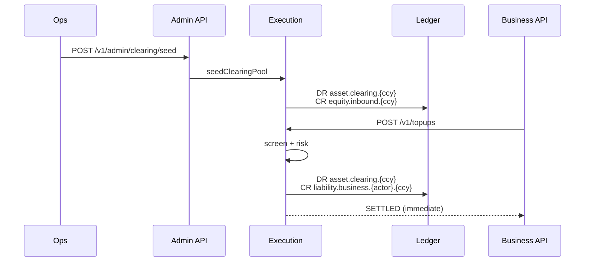

# S7 — TOPUP / inbound (Tier 2)

End-to-end runbook for **ledger credits from inbound clearing**. Tier 2 is intentionally synthetic: there is **no real pay-in rail** yet (no fiat collection webhook, no on-chain deposit detection).

## Flow overview



## Prerequisites

| Component | Requirement |
|-----------|-------------|
| Execution | Running on `:4003` |
| Ledger | Running on `:4001` |
| Compliance / Risk | Available for TOPUP screening (same as other intents) |
| Admin token | `EXECUTION_ADMIN_TOKEN` for clearing seed |

## 1. Prod clearing accounts (chart of accounts)

| Account code | Type | Purpose |
|--------------|------|---------|
| `asset.clearing.{CCY}` | ASSET | Inbound staging pool — debited on TOPUP allocation |
| `equity.inbound.{ccy}` | EQUITY | Ops offset when seeding clearing (simulated external settlement) |
| `liability.business.{biz_actor_id}.{ccy}` | LIABILITY | **TOPUP destination** — customer treasury balance |

Accounts are auto-created on first use by execution (`ensureClearingAccount`, `ensureInboundEquityAccount`).

### Bootstrap clearing pool (production)

**Option A — Admin API (recommended)**

```bash
curl -s -X POST http://localhost:4003/v1/admin/clearing/seed \
  -H "Authorization: Bearer ${EXECUTION_ADMIN_TOKEN}" \
  -H 'Content-Type: application/json' \
  -d '{
    "idempotency_key": "seed-clearing-ngn-001",
    "currency": "NGN",
    "amount_minor": "500000000",
    "memo": "Initial NGN inbound clearing float"
  }'
```

**Option B — Direct ledger journal (manual ops)**

```bash
curl -s -X POST http://localhost:4001/v1/journal-entries \
  -H 'Content-Type: application/json' \
  -d '{
    "idempotency_key": "bootstrap-clearing-ngn-manual",
    "memo": "Seed NGN clearing pool",
    "postings": [
      { "account_code": "asset.clearing.NGN", "direction": "DEBIT", "amount_minor": "500000000", "currency": "NGN" },
      { "account_code": "equity.inbound.ngn", "direction": "CREDIT", "amount_minor": "500000000", "currency": "NGN" }
    ]
  }'
```

Ensure clearing holds enough balance before customer TOPUPs. Each TOPUP debits clearing and credits the destination liability.

## 2. Business dashboard env

```bash
# apps/business/.env
BUSINESS_ACTOR_ID=biz_01HZJKMNPQRSTVWXYZ0ABCDEFGH
# Optional UUID — defaults to liability.business.{actor}.ngn
BUSINESS_FIAT_NGN_LEDGER_ACCOUNT=
```

## 3. Submit a TOPUP

### Business UI

1. Open **Top up** → enter amount, optional bank/wire reference
2. Submit — settles immediately (no routing / no PSP)
3. View transaction at `/transactions/{id}` or recent list on `/topups`

### API

```bash
curl -s -X POST http://localhost:4003/v1/topups \
  -H 'Content-Type: application/json' \
  -d '{
    "idempotency_key": "topup-demo-001",
    "actor_id": "biz_01HZJKMNPQRSTVWXYZ0ABCDEFGH",
    "destination_account_ref": "liability.business.biz_01hzjkmnpqrstvwxyz0abcdefgh.ngn",
    "amount_minor": "25000000",
    "currency": "NGN",
    "external_reference": "WIRE-REF-2026-001",
    "memo": "Treasury funding — Q2 float"
  }'
```

Response includes `topup` detail on SETTLED events:

```json
{
  "kind": "TOPUP",
  "state": "SETTLED",
  "topup": {
    "amount_minor": "25000000",
    "currency": "NGN",
    "clearing_account_id": "...",
    "destination_account_id": "...",
    "external_reference": "WIRE-REF-2026-001"
  }
}
```

## 4. Accounting notes

| Step | DR | CR |
|------|----|----|
| Ops seed | `asset.clearing.{CCY}` | `equity.inbound.{ccy}` |
| Customer TOPUP | `asset.clearing.{CCY}` | `liability.business.{actor}.{ccy}` |

Tier 2 treats inbound as **ledger allocation from a prefunded clearing pool**. Future tiers will replace the equity seed with:

- Fiat collection webhooks (Paystack / bank transfer confirmation)
- On-chain deposit detection (Base / XRPL listeners)

## 5. Admin monitoring

- **Admin → Clearing** — seed clearing pool, view recent TOPUP transactions
- **Admin → Transactions** — filter `kind=TOPUP`

## 6. Troubleshooting

| Symptom | Likely cause | Fix |
|---------|--------------|-----|
| TOPUP fails at ledger post | Insufficient clearing balance | Run clearing seed |
| `401 invalid admin token` | Missing / wrong `EXECUTION_ADMIN_TOKEN` | Set token in execution + admin env |
| Currency mismatch | Destination account currency ≠ TOPUP currency | Use matching liability account |
| Stuck in SCREENED | Compliance / risk blocked | Check compliance cases |

## 7. Tests

```bash
cd services/execution && npm test -- topup
```

Unit tests cover posting builders; integration-shape tests document COA and API contracts.
