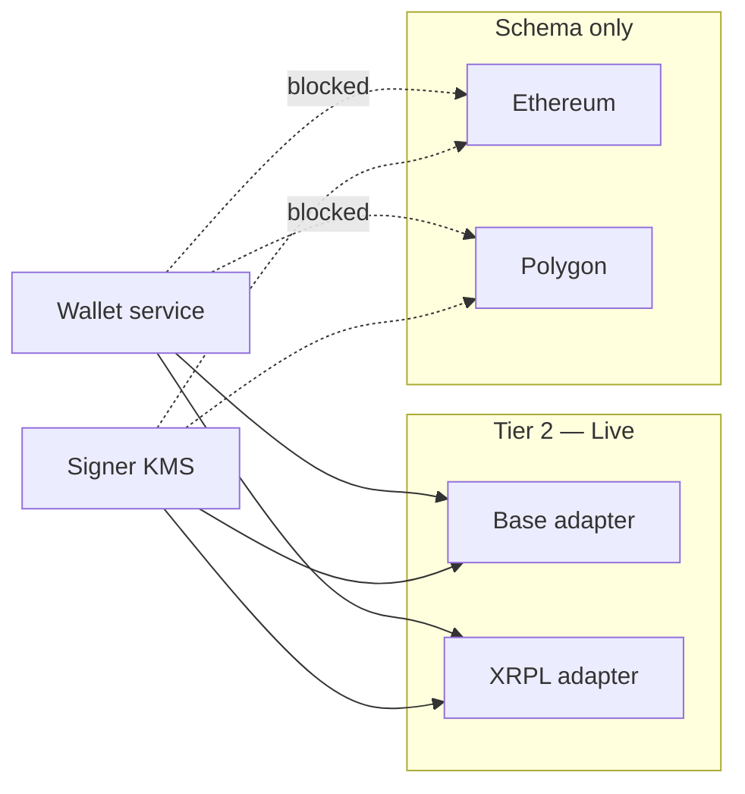

# S8 — Multi-chain wallets (Tier 2)

Operational custody across **Base** and **XRPL**, with **Ethereum** and **Polygon** reserved in schema only (not implemented).

## Rail status

| Chain | DB enum | Provision | Outbound transfer | Execution payout | Chain listener |
|-------|---------|-----------|-------------------|------------------|----------------|
| **BASE** | ✅ | ✅ | ✅ USDC, DEX, escrow | ✅ `POST /v1/payouts/base` | ✅ `chain-listener-base` |
| **XRPL** | ✅ | ✅ | ✅ XRP + IOU | ✅ `POST /v1/payouts/xrpl` | ✅ `chain-listener-xrpl` |
| **INTERNAL** | ✅ | ✅ | ❌ (ledger-only) | N/A | N/A |
| **ETHEREUM** | ✅ | ❌ blocked | ❌ | ❌ | ❌ |
| **POLYGON** | ✅ | ❌ blocked | ❌ | ❌ | ❌ |

Attempting to provision `ETHEREUM` or `POLYGON` returns:

```json
{
  "code": "wallet.chain_not_implemented",
  "message": "Chain ETHEREUM is defined in schema only — provision BASE or XRPL (Tier 2)."
}
```

## Architecture



Signer can mint EVM keys for Ethereum/Polygon, but without chain adapters, dispatchers, execution rails, or listeners those wallets would be non-functional — provision is intentionally blocked.

## 1. Provision wallets

### Base (USDC)

```bash
curl -sS -X POST http://localhost:4002/v1/wallets \
  -H 'Content-Type: application/json' \
  -d '{
    "chain": "BASE",
    "kind": "BUSINESS_CUSTODIAL",
    "owner_id": "biz_01HZJKMNPQRSTVWXYZ0ABCDEFGH",
    "owner_kind": "BUSINESS",
    "label": "Acme Base treasury"
  }'
```

See [s1-base-testnet-payout.md](./s1-base-testnet-payout.md) for payout smoke test.

### XRPL (XRP / IOU)

```bash
curl -sS -X POST http://localhost:4002/v1/wallets \
  -H 'Content-Type: application/json' \
  -d '{
    "chain": "XRPL",
    "kind": "BUSINESS_CUSTODIAL",
    "owner_id": "biz_01HZJKMNPQRSTVWXYZ0ABCDEFGH",
    "owner_kind": "BUSINESS",
    "label": "Acme XRPL treasury"
  }'
```

Configure IOU issuers in wallet env:

```bash
XRPL_IOU_ISSUERS={"USD":"rhub8VRN55s94qWKDv6jmDy1pUykJzF3wq"}
```

See [s2-xrpl-testnet-payment.md](./s2-xrpl-testnet-payment.md) and [s5-xrpl-iou.md](./s5-xrpl-iou.md).

## 2. Wallet env (multi-chain)

```bash
# services/wallet/.env
BASE_NETWORK=base-sepolia
BASE_RPC_URL=https://sepolia.base.org
WALLET_BASE_DEFAULT_PER_TX_CAP_MINOR=10000000000
WALLET_BASE_DEFAULT_DAILY_CAP_MINOR=100000000000

XRPL_NETWORK=xrpl-testnet
XRPL_WS_URL=wss://s.altnet.rippletest.net:51233
XRPL_IOU_ISSUERS={"USD":"rhub8VRN55s94qWKDv6jmDy1pUykJzF3wq"}
WALLET_XRPL_DEFAULT_PER_TX_CAP_MINOR=1000000000
WALLET_XRPL_DEFAULT_DAILY_CAP_MINOR=10000000000
```

No `ETHEREUM_*` or `POLYGON_*` env vars exist until a future tier.

## 3. Business dashboard

| Page | Purpose |
|------|---------|
| `/wallets` | Multi-chain rail overview + wallet cards (Base / XRPL) |
| `/transfers` | Send to Base (USDC) or XRPL (XRP / USD / EUR IOU) |
| `/treasury` | Aggregated balances by currency |

Chain picker in transfers excludes Ethereum/Polygon — they are not offered until implemented.

## 4. Admin dashboard

| Page | Purpose |
|------|---------|
| `/wallets` | Custody posture, multi-chain rail table, inventory, broadcast queue |

## 5. Shared chain registry

`@salychain/types` exports `CHAIN_DEFINITIONS`, `isOperationalWalletChain`, `isSchemaOnlyChain`, re-exported via `@salychain/sdk-internal`.

Use in services and UI for consistent labels and status badges.

## 6. Future: Ethereum / Polygon

When product requires additional EVM networks (per ADR-0008):

1. `packages/chain-evm` network registry (chain ID, USDC address, RPC)
2. Wallet `EvmDispatcher` + env caps
3. Execution payout endpoint + routing evaluator
4. Chain listener worker
5. Remove provision block; update business transfer chain picker
6. Runbook update superseding this section

## 7. Tests

```bash
cd services/wallet && npm test -- chains
cd packages/types && npm run build
```

Wallet `chains.spec.ts` validates registry semantics and documents Tier 2 provision allowlist.
